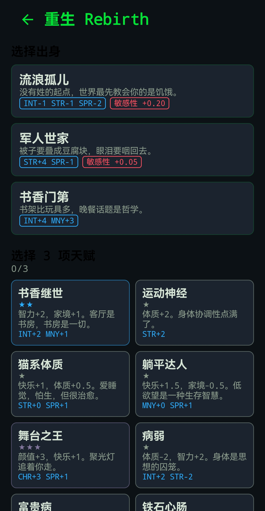

[**中文版**](README_zh.md) | **English**

# 重生 Rebirth — Android Life Restart Simulator

An Android client for [rebirth](https://github.com/xieguaiwu/rebirth), the
terminal life-restart simulator built on a computational-psychiatry model
of traumatic memory. The deterministic Go engine runs inside this app as a
child process — same seed, same life, byte-identical to the terminal
version.

```
════ 第 1 代 · 种子 20260823 ════
[出身] 贫民窟 —— 铁皮屋顶下的童年，暴力和匮乏是日常背景音。
[ 13 岁] 摇晃停止后，你在广场上睡了半个月。人离得很近，心也是。
[ 16 岁] ★ 入行：工厂工人 —— 流水线上的日复一日，汗水换温饱。
──── 人生结束：54 岁 · 职业：工厂工人 · 长期抑郁 ────
墓志铭：一生至此。
```

## Screenshot

Real-device capture (2026-09-12) — character creation (birth backgrounds
+ talent picks):



## Features

- **The real trauma model**: leaky-integrator memory trace coupled with
  amygdala reactivity and prefrontal control; a saddle-node bifurcation
  with hysteresis (enter at load ≥ 0.80, exit only below 0.35) and
  sub-additive heritability of stress sensitivity across generations.
- **Bilingual**: Chinese and English UI + content, switchable in-app.
- **339 hand-written events**, 63 talents, 26 careers, 13 birth
  backgrounds, deterministic AR(1) luck process.
- **Bring your own LLM**: configure any number of providers (DeepSeek,
  OpenRouter, or any OpenAI-compatible endpoint), reorder them as a
  fallback chain, or disable them all — the game is fully playable
  offline with zero network requests. API keys are encrypted in the
  Android Keystore and never leave the device.
- **Resilient**: the engine checkpoints after every year; killing the app
  and reopening resumes the exact same life (deterministic replay).
- **Trauma panel**: live chart of M/A/P dynamics with the hysteresis band
  and pathological-attractor latch.
- Privacy: no ads, no trackers, no telemetry. INTERNET is the only
  permission, used solely when AI narration is enabled.

## Architecture

```
┌──────────────── Android app com.xieguiawu.rebirth ────────────────┐
│  Kotlin / Jetpack Compose (5 screens: Home, Create, Timeline,    │
│  Trauma panel, Settings)                                          │
│  CoreProcess bridge: ProcessBuilder exec librebirth_core.so      │
│  JSON-lines protocol (docs/mobile-protocol.md, frozen contract)  │
└───────────────────────────────┬──────────────────────────────────┘
                                │
┌───────────────────────────────┴──────────────────────────────────┐
│  core/ — vendored Go engine (module rebirth, from                │
│  github.com/xieguaiwu/rebirth, commit in core/CORE_SOURCE_COMMIT)│
│  cmd/mobile: JSON-lines daemon · internal/game: session stepper  │
│  internal/llm: multi-provider chain with failover + breakers     │
│  data/ + data_en/: bilingual content (339 events each, embedded) │
└──────────────────────────────────────────────────────────────────┘
```

## Build

```bash
# 1. Build the Go core (arm64 pure-Go cross compile, ~1 min)
bash scripts/build-core.sh          # → app/src/main/jniLibs/arm64-v8a/

# 2. Build the app
./gradlew :app:assembleRelease      # signed only if keystore.properties exists

# 3. Reproducibility check (two clean builds, compares unsigned APKs)
bash scripts/verify-reproducible.sh
```

Requirements: JDK 17+, Android SDK (compileSdk 35), Go 1.25+ (only for
step 1; the F-Droid buildserver fetches a pinned toolchain via
`scripts/fetch-go.sh`).

### Refreshing the vendored core

```bash
bash scripts/sync-core.sh           # from ~/Desktop/go-projects/rebirth
bash scripts/sync-core.sh /path/to/rebirth
```

## F-Droid status

Prepared for submission: fastlane metadata (en-US + zh-CN), reproducible
build verified (two clean builds produce identical unsigned APKs),
fdroiddata metadata at `docs/fdroid/com.xieguiawu.rebirth.yml` (lists
v0.10.0 + v0.10.1; category Role-Playing Game), plus
`docs/fdroid/SUBMIT_GUIDE.md` and an apply-ready MR patch. Declared
anti-feature: `NonFreeNet` (optional AI narration). Screenshots:
real-device capture (2026-09-12).

**Not yet submitted** — no MR exists in `gitlab.com/fdroid/fdroiddata` for
this app, and none can be opened until the arm64 native-exec path is
confirmed on a real device (see `CONTEXT_FOR_NEXT_AGENT.md`, P0).

Signed release APK: [GitHub Release v0.10.1](https://github.com/xieguaiwu/android-rebirth/releases/tag/v0.10.1)
(`rebirth-v0.10.1.apk`, arm64-v8a, ~9 MB). Its signer certificate SHA-256
`05dc5079f0b55cce97d564c413c85c249c821435b4cac72d4893a50250bc2ae9` matches
the commented-out `AllowedAPKSigningKeys` in
`docs/fdroid/com.xieguiawu.rebirth.yml`, so the Verified-badge route is open.

`scripts/fetch-go.sh` pins the Go toolchain tarball by SHA-256 and **fails
closed**: an unpinned version with no `GO_TARBALL_SHA256` aborts instead of
building against an unverified toolchain.

## Content advisory

Mature themes throughout: trauma, mental illness, sex work, sexuality,
cult abuse. Fictional, written for adults, text only. No explicit content.

## License

[MIT](LICENSE)
